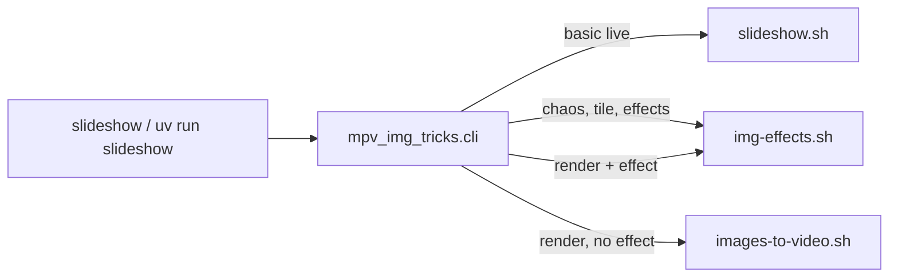
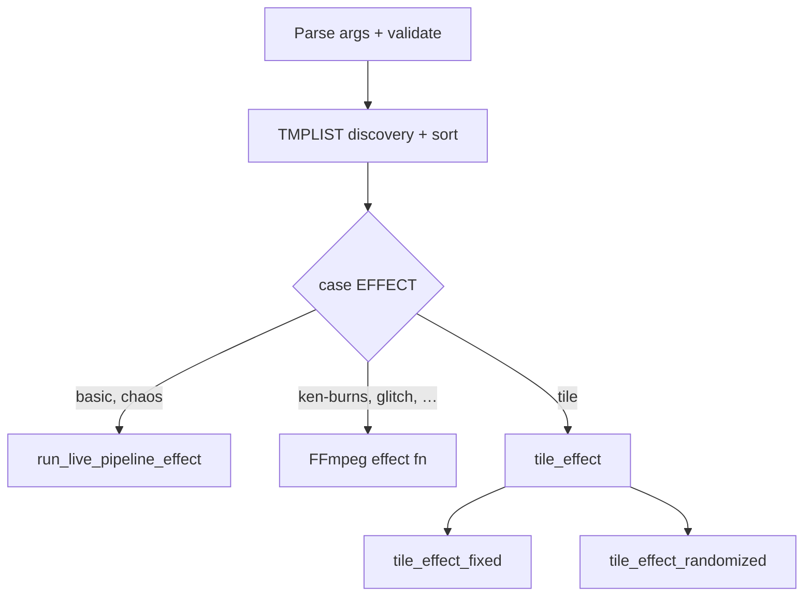

# mpv-img-tricks — discovery doc

Internal orientation for collaborators and future you. Summarizes repository layout, how the CLI maps to Bash backends, tests, and sensible next steps. **For install and day-to-day use, start with [setup.md](setup.md) and the repo [README](../README.md).** Prioritized improvement ideas: [recommendations.md](recommendations.md). **Backlog execution:** [plan.md](plan.md). **Dated implementation notes:** [dev-log/](dev-log/).

*Last reviewed from git and tree: 2026-03-31 (includes §12 deep dive on `img-effects.sh`, slideshow bindings policy, and unit-test inventory).*

---

## 1. Branch and sync (snapshot)

- Default branch: **`main`**, typically tracking **`origin/main`**.
- Re-check anytime: `git status -sb` and `git branch -vv`.
- Working tree cleanliness matters for release-style commits; this doc does not assume a particular ahead/behind count.

---

## 2. What this project is

- **Pre-alpha** personal utility: live image slideshows via **mpv**, optional **ffmpeg** renders and visual effects.
- **Public entry:** `./slideshow …` from repo root (after `uv sync`; **`live`** is the default subcommand when the first arg is not another subcommand), or `uv run slideshow`, or `python -m mpv_img_tricks`.
- **Orchestration:** Bash under `scripts/`; Python package **`mpv_img_tricks`** is a thin CLI that assembles backend commands (**do not** document direct `scripts/*.sh` invocation for end users; `image-effects.sh` is explicitly retired with an error message).

---

## 3. Recent work themes (from history)

High-level patterns from recent commits (not an exhaustive changelog):

- **Docs:** README refresh, `docs/setup.md`, PATH and symlink options for `slideshow`.
- **Packaging:** `uv` project (`pyproject.toml`, `uv.lock`), `slideshow` console script, root `./slideshow` launcher.
- **CLI:** Single **`live`** subcommand (default when omitted); default image duration **2.0 s** from `scripts/lib/constants.sh` (also sourced by **`slideshow.sh`** and **`img-effects.sh`**).
- **Semantics:** Scale modes (`fit` / `fill` / `stretch`) wired through `scripts/mpv-pipeline.sh`; argument order handling in `slideshow.sh`.
- **Effects / playback:** Tile and chaos paths, optional sound with trim, ffmpeg effect presets, memory/thread guarding for ffmpeg, file ordering (`natural` vs `om`), randomized tile groups and caching.
- **mpv bindings:** Repo **`mpv-scripts/slideshow-bindings.lua`** with a single load policy in **`scripts/lib/mpv_slideshow_bindings.sh`** (shared by **`mpv-pipeline.sh`** and **`img-effects.sh`** `run_mpv`); env **`MPV_IMG_TRICKS_NO_SLIDESHOW_BINDINGS`** disables everywhere.
- **Cursor / process:** Three-lens–style guidance may live in **global** `~/.cursor/rules`; the repo may not ship `.cursor/rules` (check git history if you expect a local copy).

---

## 4. Architecture

### 4.1 Control flow

Python **only** parses arguments and runs backends with `subprocess`. Backends own all mpv/ffmpeg invocation.

```text
./slideshow  →  uv run slideshow  →  mpv_img_tricks.cli
                                              │
                    ┌─────────────────────────┼─────────────────────────┐
                    ▼                         ▼                         ▼
           scripts/slideshow.sh     scripts/img-effects.sh    scripts/images-to-video.sh
           (basic live path)        (chaos, tile, effects)    (plain --render, no --effect)
```

- **`slideshow …`** (i.e. **`live`**, explicitly or by default) with **`--render`** and **no** `--effect` → `images-to-video.sh`.
- **`slideshow …`** with **`--render`** and an **ffmpeg** effect → `img-effects.sh`.
- **`slideshow …`** without `--render`: **`basic`** → `slideshow.sh`; **`chaos`** / **`tile`** → `img-effects.sh`.

### 4.2 Repo and scripts resolution

`mpv_img_tricks/paths.py`:

- Finds a directory that contains `scripts/slideshow.sh` by walking parents from the package and from `cwd`.
- **`MPV_IMG_TRICKS_ROOT`** — force repo root.
- **`MPV_IMG_TRICKS_SCRIPTS_DIR`** — force backend directory (used by tests to inject stub scripts).

### 4.3 CLI validation (high level)

`mpv_img_tricks/cli.py` rejects incompatible combinations (examples): `--effect` that is render-only without `--render`, live-only `--effect` with `--render`, `--watch` or `--shuffle` with `--render`, conflicting master-control flags.

**`--duration` semantics** (live vs tile vs ffmpeg renders vs plain `--render`): [setup.md § Slide duration](setup.md#slide-duration).

**mpv / slideshow bindings:** [setup.md — mpv keyboard shortcuts](setup.md#mpv-keyboard-shortcuts).

---

## 5. Complexity map (where the lines are)

| Area | Approx. size | Role |
|------|----------------|------|
| `scripts/img-effects.sh` | ~1.9k lines | Chaos, tile (grid, randomize, cache, animated tiles, sound), ffmpeg effect pipelines, multi-instance-related options |
| `scripts/mpv-pipeline.sh` | ~500+ lines | Shared mpv invocation, scaling flags |
| `scripts/slideshow.sh` | ~370 lines | Basic live path: discovery, playlist, watch, shuffle, instances |
| `scripts/images-to-video.sh` | ~180+ lines | Plain image sequence → video |
| `scripts/lib/*.sh` | small modules | `constants`, `path`, `pipeline`, `validate`, `discovery`, **`mpv_slideshow_bindings`** |
| `mpv_img_tricks/cli.py` | ~280 lines | Args, validation, backend argv assembly |

**Practical implication:** most behavior changes and regressions will touch **`img-effects.sh`**, not Python.

---

## 6. Tests

### 6.1 How to run

```bash
./tests/run-unit.sh
# or: make test   (same); make ci   (unit tests + scoped shellcheck, matches CI locally)
# Real ffmpeg: tests/manual/README.md, make manual-smoke
```

Requires **`uv`** on `PATH`. The harness runs `uv sync` (or `--frozen` when lockfile allows).

### 6.2 What exists

All tests are **Bash** under `tests/unit/*.sh`. Assertions use **`rg` (ripgrep)** — install ripgrep if tests fail on “command not found”.

| File | Asserts |
|------|---------|
| `python-cli-spike.sh` | Stub backends via `MPV_IMG_TRICKS_SCRIPTS_DIR`; correct argv for live / chaos / tile / plain render / effect render; invalid combo errors |
| `slideshow-scale-modes.sh` | Fake `mpv` on `PATH`; `mpv-pipeline.sh` scale flags; `slideshow.sh` default duration 2.0 and option/dir order |
| `img-effects-tile-animation.sh` | Stub ffmpeg/mpv/ffprobe; tile **animated** vs **still** branches; encoder override (`libx264` vs `hevc_videotoolbox`) |
| `img-effects-tile-fixed-grid.sh` | Fixed **2×1** grid, **lavfi-complex** / **xstack** path (no `--randomize`) |
| `img-effects-ken-burns.sh` | Stub ffmpeg; **zoompan** graph, **concat**, integer **d=** frame count |

### 6.3 Coverage gaps (honest)

- Most ffmpeg **effect** presets (glitch, acid, …) are not asserted.
- `--watch`, `--sound`, multi-display maps, and “tools missing” failures are not systematically tested.
- Tests are **routing and branch** checks, not pixel-perfect or full media integration tests.

### 6.4 CI / sandbox caveat

`img-effects.sh` uses process substitution and `nice`; restricted environments (some sandboxes) can fail with permission errors on `/dev/fd/*` or `setpriority`. Run the suite on a normal shell or CI image without those restrictions.

---

## 7. Runbook (minimal)

| Step | Command |
|------|---------|
| Install | `uv sync` |
| Tests | `./tests/run-unit.sh` |
| Primary use | `./slideshow <path> [options]` or `./slideshow live <path> [options]` (equivalent today) |

Full prerequisites and env vars: **[setup.md](setup.md)**.

---

## 8. Operational edges

- **Runtime deps:** Python 3.11+, Bash, mpv, ffmpeg; optional **fswatch** for `--watch`.
- **Repo weight:** Large or binary assets may live under the repo root (e.g. demo media); they are not required for `uv sync` but affect clone size.
- **Retired script:** `scripts/image-effects.sh` exits with instructions to use **`slideshow`** / **`slideshow live`** (same default subcommand).

---

## 9. Where to edit (by goal)

| Goal | First place to look |
|------|---------------------|
| New user-facing flag or help text | `mpv_img_tricks/cli.py` |
| Basic live-only behavior | `scripts/slideshow.sh`, `scripts/lib/*`, `scripts/mpv-pipeline.sh` |
| Tile / chaos / ffmpeg effects | `scripts/img-effects.sh` |
| Plain flipbook export | `scripts/images-to-video.sh` |
| Defaults (e.g. duration constant) | `scripts/lib/constants.sh` |
| Install / discovery failures | `mpv_img_tricks/paths.py`, `docs/setup.md` |

---

## 10. Suggested next steps (prioritized)

1. **CI:** [`.github/workflows/ci.yml`](../.github/workflows/ci.yml) already runs **`make test`** (with **ripgrep**) and **`make shellcheck`** on **`main`**. Extend with extra jobs, platforms, or stricter shellcheck scope when you need them.
2. **Docs:** README links here under “Architecture and maintenance”; extend §12 when you change dispatch or tile behavior.
3. **Tests:** Add one focused test per fragile area you touch next (e.g. sound trim, watch) rather than boiling the ocean.
4. **Roadmap:** Broader themes (UX, portability, `eval` removal, repo hygiene): see [recommendations.md](recommendations.md). There are no `TODO`/`FIXME` markers in-tree; track intentional follow-ups in issues or short comments near the relevant `case` branches in `img-effects.sh` if helpful.

---

## 11. Mermaid — entry to backends



Use this diagram when explaining the split between “basic pipeline” and “effects monolith.”

---

## 12. Deep dive — `img-effects.sh` dispatch and tile machinery

This section is the guided read promised in earlier orientation: how effects are chosen, how **chaos** differs from **basic live** (which does not go through this file), and how **tile** branches between cheap **lavfi** playback and expensive **ffmpeg composite** paths.

### 12.1 Exact Python routing (recap)

The table uses **`slideshow live`** for clarity; **`slideshow <path> …`** with **`live`** omitted is the same user flow (see **`DEFAULT_SUBCOMMAND`** in `cli.py`).

| User flow | Backend script | Notes |
|-----------|----------------|--------|
| `slideshow live …` (no `--effect`, not `--render`) | `slideshow.sh` | “Basic” live; see §12.2 vs §12.3 |
| `slideshow live … --effect chaos` | `img-effects.sh` | Live pipeline via `run_live_pipeline_effect` |
| `slideshow live … --effect tile` | `img-effects.sh` | Tile funnel §12.6–§12.8 |
| `slideshow live … --render` (no `--effect`) | `images-to-video.sh` | Flipbook |
| `slideshow live … --render --effect <name>` | `img-effects.sh` | FFmpeg effects use `--limit`, resolution, fps |

**Important:** `img-effects.sh` still defines `basic_effect` → `run_live_pipeline_effect basic`, but **`mpv_img_tricks.cli` never invokes that path** for **`slideshow live`** / default-**`live`** without `--effect`. The packaged entry always uses `slideshow.sh` for default basic live. The in-script `basic` case exists for anyone calling `img-effects.sh basic …` directly.

### 12.2 `slideshow.sh` — what “basic live” actually does

After parsing args and resolving `mpv-pipeline.sh`, the script:

1. Builds `TMPLIST` via `discover_images_to_playlist` with **recursive** discovery (`"true"` passed at the call site).
2. Calls `build_pipeline_common_args` with **fullscreen `yes`** and playlist **loop mode `playlist`** (not `none`).
3. Adds `--shuffle` according to `--shuffle`.
4. Optionally installs **watch mode** (`fswatch`) with an IPC socket for `mpv-pipeline.sh`.
5. Runs `"$MPV_PIPELINE" "${PIPELINE_ARGS[@]}"` — no `exec`; watch subprocess is stopped afterward.

So **basic live** is “full-screen looping playlist + optional shuffle + optional watch,” all through the shared **canonical runner** (`mpv-pipeline.sh`).

### 12.3 Top-to-bottom order inside `img-effects.sh`

Rough execution order **before** the final `case "$EFFECT"`:

1. Parse argv (`EFFECT` is `$1`, then `shift`; remaining args are flags).
2. Validate flags (scale mode only **`fit`/`fill`** for this script, instances, encoder, master control, `--order`, etc.).
3. Register `trap cleanup EXIT INT TERM` (sound temp, lua scale script, playlists, tile skip log, background audio PID).
4. Discover inputs into `TMPLIST` (directory vs glob, optional `--recursive`, image extensions); **`sort_discovered_images`** applies **`natural`** (`sort -V`) or **`om`** (oldest mtime first, portable `stat`).
5. Apply `--max-files` trim if set.
6. **Then** the bottom **`case "$EFFECT"`** dispatcher runs (see §12.9).

Render-style effects use **`get_limited_video_list`**, which copies the first **`LIMIT`** lines of `TMPLIST` to a side file and logs if that truncates the set (memory guard).

### 12.4 Live modes inside `img-effects.sh`: `run_live_pipeline_effect`

`basic_effect` and `chaos_effect` both delegate here; **`tile` does not**.

| Mode   | Loop mode   | Fullscreen | Shuffle |
|--------|-------------|------------|---------|
| `basic` | `none`      | `no`       | `no` (+ `--mpv-arg --playlist-start=0`) |
| `chaos` | `playlist` | `yes`      | `yes` |

The function resolves **`mpv-pipeline.sh`**, builds shared pipeline argv (`build_pipeline_common_args`, audio, optional `--extra-script` for **`--random-scale`** lua), then **`exec`** the pipeline — the shell is replaced; no return to caller.

Sound: if **`--sound`** is set, passes `--no-audio no` and mpv **`--audio-file=`**; else **`--no-audio yes`**. For **tile** with sound, behavior differs: see §12.6 (background `mpv` loop + main player **`--no-audio`**).

### 12.5 FFmpeg “video effect” pattern (non-tile renders)

Effects such as **ken-burns**, **crossfade**, **glitch**, **acid**, etc. follow the same skeleton:

1. `input_list="$(get_limited_video_list "EffectName")"`.
2. Bash loops read paths from `input_list`, building **`-filter_complex`** subgraphs and per-input **ffmpeg** `-loop 1 -t DURATION -i …` clauses.
3. **`build_video_audio_args`** may prepend a looping audio input and map AAC when `--sound` is set (after **`prepare_sound_file`** trim).
4. One **`eval "ffmpeg ${FFMPEG_MEM_ARGS} …"`** line writes **`OUTPUT`** (or a default filename). **`FFMPEG_MEM_ARGS`** caps filter/thread parallelism.

After the dispatcher, if **`OUTPUT`** is set and the effect is not basic/chaos, the script prints a suggested **`mpv --fs`** command.

### 12.6 `tile_effect` — entry and sound

Approximate **line region ~822** onward:

1. **`configure_tile_video_encoder`** when **`--animate-videos`**: probes `ffmpeg -encoders` for VideoToolbox / libx265 / libx264 and fills **`TILE_VIDEO_CODEC_ARGS`**.
2. **`filter_tile_readable_inputs`** (**validate-media**): optional **`ffprobe`** on each playlist entry; uses **`run_under_nice`** and **`-threads 1`**. Do not pass ffmpeg-only options to **`ffprobe`** (e.g. **`-nostdin`**) — on **FFmpeg 8+** they make **`ffprobe`** exit with an error so every file looks unreadable. Probe accepts **any video stream**, then extension-scoped demux checks, then **any** demuxable file (odd/recovered extensions). Results are cached under **`~/.cache/mpv-img-tricks/ffprobe-tile-v5/`** with **MD5** when **`md5`/`md5sum`** exist; cache keys use **`stat`** plus **MD5 of the first 64KiB** (no paths) for every file so inode-0 / external volumes never collapse many files onto one cache entry. Set **`MPV_IMG_TRICKS_NO_FFPROBE_TILE_CACHE`** to bypass. Parallelism uses the same **`JOBS`** / **`resolve_parallel_job_count_for_tile`** rule as compositing.
3. **Sound**
   - If **`SOUND_FILE`**: background loop **`mpv`** starts on the first **`run_mpv`** (not during compositing prep); the main tile player uses **`AUDIO_ARGS=(--no-audio)`** so video sync stays simple.
   - Else: **`build_audio_args`** for inline mpv audio when supported.
4. **`detect_screen_resolution`**: macOS **`system_profiler SPDisplaysDataType`**, Linux **`xrandr`**, else falls back to **`RESOLUTION`**.
5. Branch: **`RANDOMIZE`** → **`tile_effect_randomized`**, else **`tile_effect_fixed`**.

### 12.7 Fixed grid: lavfi fast path vs ffmpeg composites

**`tile_effect_fixed`** (~1139+):

- Computes cell geometry from **`GRID`**, **`SPACING`**, and detected screen size; **`build_tile_cell_filter`** maps **`fit`** vs **`fill`** to scale/pad vs scale/crop.

**Heavy path** when **`INPUT_COUNT > TILE_COUNT`** OR **`SPACING > 0`**:

- Renders each slide to a temp directory with **`nice -n 10 ffmpeg`** — either **one frame** (`-frames:v 1` → `.jpg`) or **animated** segment (`-t "$DURATION"` → `.mp4`) depending on **`ANIMATE_VIDEOS`**.
- Plays the ordered composites with **`run_mpv`**, then **`rm -rf` the composite dir**.

**Light path** (single “page” that fits the grid **and** **no spacing**):

- Builds **`--lavfi-complex`** **`xstack`** graph, attaches up to **`TILE_COUNT`** files via first file + **`--external-file`**, and runs **`run_mpv`** once (live compositing).

Comment in-script: spacing forces the composite path because the lavfi layout does not implement gaps cleanly.

### 12.8 Randomized tile: layouts, cache, memory sampling

**`tile_effect_randomized`** (~1459+):

1. Builds a pool of **`cols x rows : tile_count`** layouts constrained by **`GROUP_SIZE`**.
2. Defines nested **`play_composite_dir`**: collects **`*.jpg`** or **`*.mp4`**, sorts, invokes **`run_mpv`** with **`--shuffle`** and **`--loop-playlist=inf`** (still images use **`--image-display-duration`**; video composites omit it).
3. **Cache** (when **`CACHE_COMPOSITES`** true): directory **`~/.cache/mpv-img-tricks/tile-randomized/`**, keyed by **`shasum`** (or **`cksum`**) over metadata including **`CACHE_VERSION`**, **`source_manifest`** (**SHA-256** of the ordered per-file **`ffprobe-tile-v5`**-style identity lines — no directory path), screen, group size, animate flag, encoder, duration, fps, scale, spacing. On hit, replays cached composites without rebuilding.
4. Compositing loop: parallel jobs ( **`JOBS`** or half CPU count), **`render_randomized_slide`**, tracks **`ACTIVE_PIDS`**, optional **RSS** sampling and **>512MB** warning for the script process.

**Cleanup:** `trap` + end of randomized path remove temps; cached dirs are kept when **`cache_used`**.

### 12.9 Bottom dispatcher (effect switch)

The **`case "$EFFECT"`** at **~1879–1919** is the single exit switch: **`basic`**, **`chaos`**, **`ken-burns`**, **`crossfade`**, **`glitch`**, **`acid`**, **`reality`**, **`kaleido`**, **`matrix`**, **`liquid`**, **`tile`**, default error.

Immediately after: remove **`TMPLIST`**; optional **“Play with mpv”** hint for rendered outputs.

### 12.10 Cross-file relationships

- **`scripts/lib/pipeline.sh`** (sourced): **`build_pipeline_common_args`**, shared between **`slideshow.sh`** and **`img-effects.sh`** live paths.
- **`scripts/lib/mpv_slideshow_bindings.sh`**: whether to add **`--script=…/slideshow-bindings.lua`** (CLI **`--use-slideshow-bindings`** plus env **`MPV_IMG_TRICKS_NO_SLIDESHOW_BINDINGS`**); used by **`mpv-pipeline.sh`** and **`img-effects.sh`** **`run_mpv`**.
- **`scripts/mpv-pipeline.sh`**: actual mpv launcher / multi-instance wiring consumed by **`run_live_pipeline_effect`** and **`slideshow.sh`**.
- **`scripts/lib/validate.sh`**: shared validation helpers.

### 12.11 Diagram — inside `img-effects.sh` after discovery



This complements §11: §11 is package-level routing; §12 is **inside** the largest backend script.
