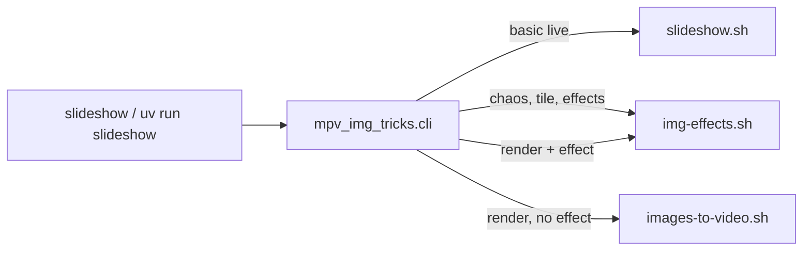

# mpv-img-tricks — discovery doc

Internal orientation for collaborators and future you. Summarizes repository layout, how the CLI maps to Bash backends, tests, and sensible next steps. **For install and day-to-day use, start with [setup.md](setup.md) and the repo [README](../README.md).**

*Last reviewed from git and tree: 2026-03-31.*

---

## 1. Branch and sync (snapshot)

- Default branch: **`main`**, typically tracking **`origin/main`**.
- Re-check anytime: `git status -sb` and `git branch -vv`.
- Working tree cleanliness matters for release-style commits; this doc does not assume a particular ahead/behind count.

---

## 2. What this project is

- **Pre-alpha** personal utility: live image slideshows via **mpv**, optional **ffmpeg** renders and visual effects.
- **Public entry:** `./slideshow live …` from repo root (after `uv sync`), or `uv run slideshow`, or `python -m mpv_img_tricks`.
- **Orchestration:** Bash under `scripts/`; Python package **`mpv_img_tricks`** is a thin CLI that assembles backend commands (**do not** document direct `scripts/*.sh` invocation for end users; `image-effects.sh` is explicitly retired with an error message).

---

## 3. Recent work themes (from history)

High-level patterns from recent commits (not an exhaustive changelog):

- **Docs:** README refresh, `docs/setup.md`, PATH and symlink options for `slideshow`.
- **Packaging:** `uv` project (`pyproject.toml`, `uv.lock`), `slideshow` console script, root `./slideshow` launcher.
- **CLI:** Single `slideshow live` UX; default image duration **2.0 s** (see `scripts/lib/constants.sh`).
- **Semantics:** Scale modes (`fit` / `fill` / `stretch`) wired through `scripts/mpv-pipeline.sh`; argument order handling in `slideshow.sh`.
- **Effects / playback:** Tile and chaos paths, optional sound with trim, ffmpeg effect presets, memory/thread guarding for ffmpeg, file ordering (`natural` vs `om`), randomized tile groups and caching.
- **Cursor / process:** Three-lens–style guidance may live in **global** `~/.cursor/rules`; the repo may not ship `.cursor/rules` (check git history if you expect a local copy).

---

## 4. Architecture

### 4.1 Control flow

Python **only** parses arguments and runs backends with `subprocess`. Backends own all mpv/ffmpeg invocation.

```text
./slideshow  →  uv run slideshow  →  mpv_img_tricks.cli
                                              │
                    ┌─────────────────────────┼─────────────────────────┐
                    ▼                         ▼                         ▼
           scripts/slideshow.sh     scripts/img-effects.sh    scripts/images-to-video.sh
           (basic live path)        (chaos, tile, effects)    (plain --render, no --effect)
```

- **`slideshow live`** with **`--render`** and **no** `--effect` → `images-to-video.sh`.
- **`slideshow live`** with **`--render`** and an **ffmpeg** effect → `img-effects.sh`.
- **`slideshow live`** without `--render`: **`basic`** → `slideshow.sh`; **`chaos`** / **`tile`** → `img-effects.sh`.

### 4.2 Repo and scripts resolution

`mpv_img_tricks/paths.py`:

- Finds a directory that contains `scripts/slideshow.sh` by walking parents from the package and from `cwd`.
- **`MPV_IMG_TRICKS_ROOT`** — force repo root.
- **`MPV_IMG_TRICKS_SCRIPTS_DIR`** — force backend directory (used by tests to inject stub scripts).

### 4.3 CLI validation (high level)

`mpv_img_tricks/cli.py` rejects incompatible combinations (examples): `--effect` that is render-only without `--render`, live-only `--effect` with `--render`, `--watch` or `--shuffle` with `--render`, conflicting master-control flags.

---

## 5. Complexity map (where the lines are)

| Area | Approx. size | Role |
|------|----------------|------|
| `scripts/img-effects.sh` | ~1.9k lines | Chaos, tile (grid, randomize, cache, animated tiles, sound), ffmpeg effect pipelines, multi-instance-related options |
| `scripts/mpv-pipeline.sh` | ~500+ lines | Shared mpv invocation, scaling flags |
| `scripts/slideshow.sh` | ~370 lines | Basic live path: discovery, playlist, watch, shuffle, instances |
| `scripts/images-to-video.sh` | ~180+ lines | Plain image sequence → video |
| `scripts/lib/*.sh` | small modules | `discovery`, `validate`, `pipeline`, `path`, `constants` |
| `mpv_img_tricks/cli.py` | ~280 lines | Args, validation, backend argv assembly |

**Practical implication:** most behavior changes and regressions will touch **`img-effects.sh`**, not Python.

---

## 6. Tests

### 6.1 How to run

```bash
./tests/run-unit.sh
```

Requires **`uv`** on `PATH`. The harness runs `uv sync` (or `--frozen` when lockfile allows).

### 6.2 What exists

All tests are **Bash** under `tests/unit/*.sh`. Assertions use **`rg` (ripgrep)** — install ripgrep if tests fail on “command not found”.

| File | Asserts |
|------|---------|
| `python-cli-spike.sh` | Stub backends via `MPV_IMG_TRICKS_SCRIPTS_DIR`; correct argv for live / chaos / tile / plain render / effect render; invalid combo errors |
| `slideshow-scale-modes.sh` | Fake `mpv` on `PATH`; `mpv-pipeline.sh` scale flags; `slideshow.sh` default duration 2.0 and option/dir order |
| `img-effects-tile-animation.sh` | Stub ffmpeg/mpv/ffprobe; tile **animated** vs **still** branches; encoder override (`libx264` vs `hevc_videotoolbox`) |

### 6.3 Coverage gaps (honest)

- Most ffmpeg **effect** presets (glitch, acid, …) are not asserted.
- `--watch`, `--sound`, multi-display maps, and “tools missing” failures are not systematically tested.
- Tests are **routing and branch** checks, not pixel-perfect or full media integration tests.

### 6.4 CI / sandbox caveat

`img-effects.sh` uses process substitution and `nice`; restricted environments (some sandboxes) can fail with permission errors on `/dev/fd/*` or `setpriority`. Run the suite on a normal shell or CI image without those restrictions.

---

## 7. Runbook (minimal)

| Step | Command |
|------|---------|
| Install | `uv sync` |
| Tests | `./tests/run-unit.sh` |
| Primary use | `./slideshow live <path> [options]` |

Full prerequisites and env vars: **[setup.md](setup.md)**.

---

## 8. Operational edges

- **Runtime deps:** Python 3.11+, Bash, mpv, ffmpeg; optional **fswatch** for `--watch`.
- **Repo weight:** Large or binary assets may live under the repo root (e.g. demo media); they are not required for `uv sync` but affect clone size.
- **Retired script:** `scripts/image-effects.sh` exits with instructions to use `./slideshow live`.

---

## 9. Where to edit (by goal)

| Goal | First place to look |
|------|---------------------|
| New user-facing flag or help text | `mpv_img_tricks/cli.py` |
| Basic live-only behavior | `scripts/slideshow.sh`, `scripts/lib/*`, `scripts/mpv-pipeline.sh` |
| Tile / chaos / ffmpeg effects | `scripts/img-effects.sh` |
| Plain flipbook export | `scripts/images-to-video.sh` |
| Defaults (e.g. duration constant) | `scripts/lib/constants.sh` |
| Install / discovery failures | `mpv_img_tricks/paths.py`, `docs/setup.md` |

---

## 10. Suggested next steps (prioritized)

1. **CI:** Add a workflow: checkout → `uv sync --frozen` → `./tests/run-unit.sh` (with ripgrep available).
2. **Docs:** Link this file from README only if you want newcomers to find it; otherwise keep it discoverable via `docs/`.
3. **Tests:** Add one focused test per fragile area you touch next (e.g. sound trim, watch) rather than boiling the ocean.
4. **Roadmap:** There are no `TODO`/`FIXME` markers in-tree; track intentional follow-ups in issues or short comments near the relevant `case` branches in `img-effects.sh` if helpful.

---

## 11. Mermaid — entry to backends



Use this diagram when explaining the split between “basic pipeline” and “effects monolith.”
