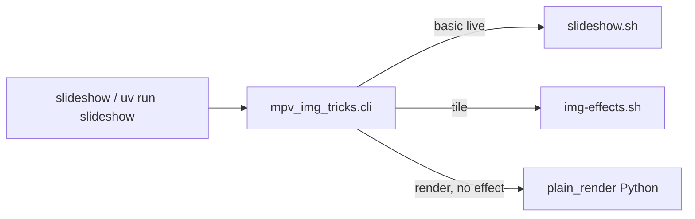

# mpv-img-tricks — discovery doc

Internal orientation for collaborators and future you. Summarizes repository layout, how the CLI maps to Bash backends, tests, and sensible next steps. **For install and day-to-day use, start with [setup.md](setup.md) and the repo [README](../README.md).** Prioritized improvement ideas: [recommendations.md](recommendations.md). **Backlog execution:** [plan.md](plan.md). **Dated implementation notes:** [dev-log/](dev-log/).

*Last reviewed from git and tree: 2026-03-31 (includes §12 deep dive on `img-effects.sh`, slideshow bindings policy, and unit-test inventory).*

---

## 1. Branch and sync (snapshot)

- Default branch: **`main`**, typically tracking **`origin/main`**.
- Re-check anytime: `git status -sb` and `git branch -vv`.
- Working tree cleanliness matters for release-style commits; this doc does not assume a particular ahead/behind count.

---

## 2. What this project is

- **Pre-alpha** personal utility: live image slideshows via **mpv**, optional **ffmpeg** renders and visual effects.
- **Public entry:** `./slideshow …` from repo root (after `uv sync`; **`live`** is the default subcommand when the first arg is not another subcommand), or `uv run slideshow`, or `python -m mpv_img_tricks`.
- **Orchestration:** Bash under `scripts/`; Python package **`mpv_img_tricks`** is a thin CLI that assembles backend commands (**do not** document direct `scripts/*.sh` invocation for end users; `image-effects.sh` is explicitly retired with an error message).

---

## 3. Recent work themes (from history)

High-level patterns from recent commits (not an exhaustive changelog):

- **Docs:** README refresh, `docs/setup.md`, PATH and symlink options for `slideshow`.
- **Packaging:** `uv` project (`pyproject.toml`, `uv.lock`), `slideshow` console script, root `./slideshow` launcher.
- **CLI:** Single **`live`** subcommand (default when omitted); default image duration **2.0 s** from `scripts/lib/constants.sh` (also sourced by **`slideshow.sh`** and **`img-effects.sh`**).
- **Semantics:** Scale modes (`fit` / `fill` / `stretch`) wired through `scripts/mpv-pipeline.sh`; argument order handling in `slideshow.sh`.
- **Effects / playback:** Tile path in **`img-effects.sh`**, optional sound with trim, memory/thread guarding for ffmpeg, file ordering (`natural` / `om` / `nm`), randomized tile groups and caching. Plain **`--render`** is implemented in Python (`mpv_img_tricks.pipelines.plain_render`).
- **mpv bindings:** Repo **`mpv-scripts/slideshow-bindings.lua`** with a single load policy in **`scripts/lib/mpv_slideshow_bindings.sh`** (shared by **`mpv-pipeline.sh`** and **`img-effects.sh`** `run_mpv`); env **`MPV_IMG_TRICKS_NO_SLIDESHOW_BINDINGS`** disables everywhere.
- **Cursor / process:** Three-lens–style guidance may live in **global** `~/.cursor/rules`; the repo may not ship `.cursor/rules` (check git history if you expect a local copy).

---

## 4. Architecture

### 4.1 Control flow

The CLI parses arguments; **basic live** runs **mpv** from Python (**`basic_slideshow`** + **`mpv_pipeline`**); **tile** still shells out to **`img-effects.sh`**; plain **`--render`** uses Python + ffmpeg.

```text
./slideshow  →  uv run slideshow  →  mpv_img_tricks.cli
                                              │
                    ┌─────────────────────────┼─────────────────────────┐
                    ▼                         ▼                         ▼
      basic_slideshow + mpv_pipeline     img-effects.sh           plain_render (Python + ffmpeg)
      (subprocess mpv)                    (tile only)              (--render, no --effect)
```

- **`slideshow …`** with **`--render`** and **no** `--effect` → **`mpv_img_tricks.pipelines.plain_render`** (not the legacy `images-to-video.sh` script).
- **`slideshow …`** with **`--render`** and **`--effect`** → **rejected** by the CLI.
- **`slideshow …`** without `--render`: **`basic`** → **`pipelines.basic_slideshow`**; **`tile`** → `img-effects.sh`.

### 4.2 Repo and scripts resolution

`mpv_img_tricks/paths.py`:

- Finds a directory that contains `scripts/slideshow.sh` by walking parents from the package and from `cwd`.
- **`MPV_IMG_TRICKS_ROOT`** — force repo root.
- **`MPV_IMG_TRICKS_SCRIPTS_DIR`** — force backend directory (used by tests to inject stub scripts).

### 4.3 CLI validation (high level)

`mpv_img_tricks/cli.py` rejects incompatible combinations (examples): `--effect` that is render-only without `--render`, live-only `--effect` with `--render`, `--watch` or `--shuffle` with `--render`, conflicting master-control flags.

**`--duration` semantics** (live vs tile vs ffmpeg renders vs plain `--render`): [setup.md § Slide duration](setup.md#slide-duration).

**mpv / slideshow bindings:** [setup.md — mpv keyboard shortcuts](setup.md#mpv-keyboard-shortcuts).

---

## 5. Complexity map (where the lines are)

| Area | Approx. size | Role |
|------|----------------|------|
| `scripts/img-effects.sh` | ~1.9k lines | Chaos, tile (grid, randomize, cache, animated tiles, sound), ffmpeg effect pipelines, multi-instance-related options |
| `scripts/mpv-pipeline.sh` | ~500+ lines | Shared mpv invocation, scaling flags |
| `scripts/slideshow.sh` | ~370 lines | Basic live path: discovery, playlist, watch, shuffle, instances |
| `scripts/images-to-video.sh` | ~180+ lines | Plain image sequence → video |
| `scripts/lib/*.sh` | small modules | `constants`, `path`, `pipeline`, `validate`, `discovery`, **`mpv_slideshow_bindings`** |
| `mpv_img_tricks/cli.py` | ~280 lines | Args, validation, backend argv assembly |

**Practical implication:** most behavior changes and regressions will touch **`img-effects.sh`**, not Python.

---

## 6. Tests

### 6.1 How to run

```bash
./tests/run-unit.sh
# or: make test   (same); make ci   (unit tests + scoped shellcheck, matches CI locally)
# Real ffmpeg: tests/manual/README.md, make manual-smoke
```

Requires **`uv`** on `PATH`. The harness runs `uv sync` (or `--frozen` when lockfile allows).

### 6.2 What exists

All tests are **Bash** under `tests/unit/*.sh`. Assertions use **`rg` (ripgrep)** — install ripgrep if tests fail on “command not found”.

| File | Asserts |
|------|---------|
| `python-cli-spike.sh` | Stub backends via `MPV_IMG_TRICKS_SCRIPTS_DIR`; argv for live / tile / plain render (Python); invalid `--effect` / `--render` combos |
| `slideshow-scale-modes.sh` | Fake `mpv` on `PATH`; `mpv-pipeline.sh` scale flags; `slideshow.sh` default duration 2.0 and option/dir order |
| `img-effects-tile-animation.sh` | Stub ffmpeg/mpv/ffprobe; tile **animated** vs **still** branches; encoder override (`libx264` vs `hevc_videotoolbox`) |
| `img-effects-tile-fixed-grid.sh` | Fixed **2×1** grid, **lavfi-complex** / **xstack** path (no `--randomize`) |
| `tests/test_media_discovery.py` | pytest: image discovery / ordering |

### 6.3 Coverage gaps (honest)

- Tile compositing branches are partially covered; edge cases remain manual.
- `--watch`, `--sound`, multi-display maps, and “tools missing” failures are not systematically tested.
- Tests are **routing and branch** checks, not pixel-perfect or full media integration tests.

### 6.4 CI / sandbox caveat

`img-effects.sh` uses process substitution and `nice`; restricted environments (some sandboxes) can fail with permission errors on `/dev/fd/*` or `setpriority`. Run the suite on a normal shell or CI image without those restrictions.

---

## 7. Runbook (minimal)

| Step | Command |
|------|---------|
| Install | `uv sync` |
| Tests | `./tests/run-unit.sh` |
| Primary use | `./slideshow <path> [options]` or `./slideshow live <path> [options]` (equivalent today) |

Full prerequisites and env vars: **[setup.md](setup.md)**.

---

## 8. Operational edges

- **Runtime deps:** Python 3.11+, Bash, mpv, ffmpeg; optional **fswatch** for `--watch`.
- **Repo weight:** Large or binary assets may live under the repo root (e.g. demo media); they are not required for `uv sync` but affect clone size.
- **Retired script:** `scripts/image-effects.sh` exits with instructions to use **`slideshow`** / **`slideshow live`** (same default subcommand).

---

## 9. Where to edit (by goal)

| Goal | First place to look |
|------|---------------------|
| New user-facing flag or help text | `mpv_img_tricks/cli.py` |
| Basic live-only behavior | `scripts/slideshow.sh`, `scripts/lib/*`, `scripts/mpv-pipeline.sh` |
| Tile | `scripts/img-effects.sh` |
| Plain flipbook export | `mpv_img_tricks.pipelines.plain_render` (legacy: `scripts/images-to-video.sh`) |
| Defaults (e.g. duration constant) | `scripts/lib/constants.sh` |
| Install / discovery failures | `mpv_img_tricks/paths.py`, `docs/setup.md` |

---

## 10. Suggested next steps (prioritized)

1. **CI:** [`.github/workflows/ci.yml`](../.github/workflows/ci.yml) already runs **`make test`** (with **ripgrep**) and **`make shellcheck`** on **`main`**. Extend with extra jobs, platforms, or stricter shellcheck scope when you need them.
2. **Docs:** README links here under “Architecture and maintenance”; extend §12 when you change dispatch or tile behavior.
3. **Tests:** Add one focused test per fragile area you touch next (e.g. sound trim, watch) rather than boiling the ocean.
4. **Roadmap:** Broader themes (UX, portability, `eval` removal, repo hygiene): see [recommendations.md](recommendations.md). There are no `TODO`/`FIXME` markers in-tree; track intentional follow-ups in issues or short comments near the relevant `case` branches in `img-effects.sh` if helpful.

---

## 11. Mermaid — entry to backends



Use this diagram for package-level routing (tile remains Bash-heavy; plain render is Python).

---

## 12. Deep dive — `img-effects.sh` tile machinery

**Scope:** `img-effects.sh` is **tile-only** (non-tile ffmpeg presets and live basic/chaos paths were removed). **Basic** live is **`mpv_img_tricks.pipelines.basic_slideshow`** (mpv parity with former **`mpv-pipeline.sh`**). **`scripts/slideshow.sh`** is a thin shim to **`uv run slideshow live`**. **Plain `--render`** is **`mpv_img_tricks.pipelines.plain_render`**.

### 12.1 CLI routing (recap)

| User flow | Backend | Notes |
|-----------|---------|--------|
| `slideshow live …` (no `--effect`, not `--render`) | Python `basic_slideshow` | Basic live (subprocess **mpv**) |
| `slideshow live … --effect tile` | `img-effects.sh` | Tile §12.6–§12.8 |
| `slideshow live … --render` (no `--effect`) | Python `plain_render` | Flipbook |
| `slideshow live … --render` + `--effect` | — | **Rejected** by CLI |

**Direct `img-effects.sh`:** first positional must be **`tile`** (script exits otherwise).

### 12.2 Basic live (Python)

`mpv_img_tricks.pipelines.basic_slideshow` + `mpv_img_tricks.mpv_pipeline`:

1. Builds the playlist via **`media_discovery.discover_sources_to_playlist`** (parity with **`scripts/lib/discovery.sh`**: sources, recursive vs top-level, **`--order`**).
2. Launches **mpv** with **fullscreen**, **playlist loop**, scale flags from **`--scale-mode`**, optional **shuffle**, optional **watch** (`fswatch` + IPC `loadfile` / `playlist-pos`, instances **1** only), and **multi-instance** + **master-control bridge** when **`--instances` > 1** (parity with **`mpv-pipeline.sh`**).

`scripts/slideshow.sh` is only a compatibility shim: **`exec uv run slideshow live "$@"`**.

### 12.3 Top-to-bottom order inside `img-effects.sh` (tile)

1. Parse argv (`EFFECT` must be **`tile`**, then `shift`; remaining args are flags).
2. Validate flags (scale mode **`fit`/`fill`**, instances, encoder, master control, `--order`, etc.).
3. Register `trap cleanup EXIT INT TERM` (sound temp, playlists, tile skip log, background audio PID).
4. Discover inputs into `TMPLIST`; shared **`discovery.sh`** applies **`natural`**, **`om`**, or **`nm`**.
5. Apply `--max-files` trim if set.
6. Run **`tile_effect`** (no multi-effect dispatcher).

### 12.4 `tile_effect` — entry and sound

Approximate **line region ~822** onward:

1. **`configure_tile_video_encoder`** when **`--animate-videos`**: probes `ffmpeg -encoders` for VideoToolbox / libx265 / libx264 and fills **`TILE_VIDEO_CODEC_ARGS`**.
2. **`filter_tile_readable_inputs`** (**validate-media**): optional **`ffprobe`** on each playlist entry; uses **`run_under_nice`** and **`-threads 1`**. Do not pass ffmpeg-only options to **`ffprobe`** (e.g. **`-nostdin`**) — on **FFmpeg 8+** they make **`ffprobe`** exit with an error so every file looks unreadable. **`MPV_IMG_TRICKS_FFPROBE_VALIDATE_DEBUG`** (see [setup.md](setup.md)) or an all-skipped run adds **stderr** samples for the first few failures. Probe accepts **any video stream**, then extension-scoped demux checks, then **any** demuxable file (odd/recovered extensions). Results are cached under **`~/.cache/mpv-img-tricks/ffprobe-tile-v5/`** with **MD5** when **`md5`/`md5sum`** exist; cache keys use **`stat`** plus **MD5 of the first 64KiB** (no paths) for every file so inode-0 / external volumes never collapse many files onto one cache entry. Set **`MPV_IMG_TRICKS_NO_FFPROBE_TILE_CACHE`** to bypass. Parallelism uses the same **`JOBS`** / **`resolve_parallel_job_count_for_tile`** rule as compositing.
3. **Sound**
   - If **`SOUND_FILE`**: background loop **`mpv`** starts on the first **`run_mpv`** (not during compositing prep); the main tile player uses **`AUDIO_ARGS=(--no-audio)`** so video sync stays simple.
   - Else: **`build_audio_args`** for inline mpv audio when supported.
4. **`detect_screen_resolution`**: macOS **`system_profiler SPDisplaysDataType`**, Linux **`xrandr`**, else falls back to **`RESOLUTION`**.
5. Branch: **`RANDOMIZE`** → **`tile_effect_randomized`**, else **`tile_effect_fixed`**.

### 12.5 Fixed grid: lavfi fast path vs ffmpeg composites

**`tile_effect_fixed`** (~1139+):

- Computes cell geometry from **`GRID`**, **`SPACING`**, and detected screen size; **`build_tile_cell_filter`** maps **`fit`** vs **`fill`** to scale/pad vs scale/crop.

**Heavy path** when **`INPUT_COUNT > TILE_COUNT`** OR **`SPACING > 0`**:

- Renders each slide to a temp directory with **`nice -n 10 ffmpeg`** — either **one frame** (`-frames:v 1` → `.jpg`) or **animated** segment (`-t "$DURATION"` → `.mp4`) depending on **`ANIMATE_VIDEOS`**.
- Plays the ordered composites with **`run_mpv`**, then **`rm -rf` the composite dir**.

**Light path** (single “page” that fits the grid **and** **no spacing**):

- Builds **`--lavfi-complex`** **`xstack`** graph, attaches up to **`TILE_COUNT`** files via first file + **`--external-file`**, and runs **`run_mpv`** once (live compositing).

Comment in-script: spacing forces the composite path because the lavfi layout does not implement gaps cleanly.

### 12.6 Randomized tile: layouts, cache, memory sampling

**`tile_effect_randomized`** (~1459+):

1. Builds a pool of **`cols x rows : tile_count`** layouts constrained by **`GROUP_SIZE`**.
2. Defines nested **`play_composite_dir`**: collects **`*.jpg`** or **`*.mp4`**, sorts, invokes **`run_mpv`** with **`--shuffle`** and **`--loop-playlist=inf`** (still images use **`--image-display-duration`**; video composites omit it).
3. **Cache** (when **`CACHE_COMPOSITES`** true): directory **`~/.cache/mpv-img-tricks/tile-randomized/`**, keyed by **`shasum`** (or **`cksum`**) over metadata including **`CACHE_VERSION`**, **`source_manifest`** (**SHA-256** of the ordered per-file **`ffprobe-tile-v5`**-style identity lines — no directory path), screen, group size, animate flag, encoder, duration, fps, scale, spacing. On hit, replays cached composites without rebuilding.
4. Compositing loop: parallel jobs ( **`JOBS`** or half CPU count), **`render_randomized_slide`**, tracks **`ACTIVE_PIDS`**, optional **RSS** sampling and **>512MB** warning for the script process.

**Cleanup:** `trap` + end of randomized path remove temps; cached dirs are kept when **`cache_used`**.

### 12.7 Cross-file relationships

- **`scripts/lib/pipeline.sh`** (sourced): **`build_pipeline_common_args`**, shared with **`slideshow.sh`** (not used for tile live `run_mpv` the same way, but helpers overlap conceptually).
- **`scripts/lib/mpv_slideshow_bindings.sh`**: whether to add **`--script=…/slideshow-bindings.lua`**; used by **`mpv-pipeline.sh`** and **`img-effects.sh`** **`run_mpv`**.
- **`scripts/mpv-pipeline.sh`**: mpv launcher consumed by **`slideshow.sh`**.
- **`scripts/lib/validate.sh`**: shared validation helpers.
